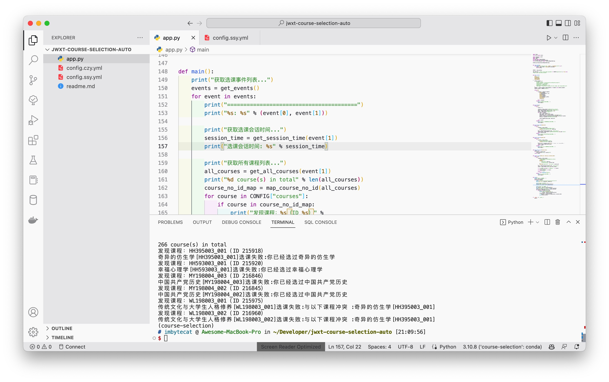

# 自动化选课

## 依赖

- Python 3.10
  - requests
  - pyyaml
  - beautifulsoup4
  - pyjson5

## 使用

通过 [开课查询](https://jwxt.shmtu.edu.cn/shmtu/teachTaskSearch.action)，查找 **课序号**，填写到配置文件中。

选课前 15 分钟左右，提前登录获取教务系统 cookie，避免高峰期卡顿无法登陆，但也不要过早登录，防止 cookie 失效，cookie 填写到配置文件中。

选课时打开软件。
